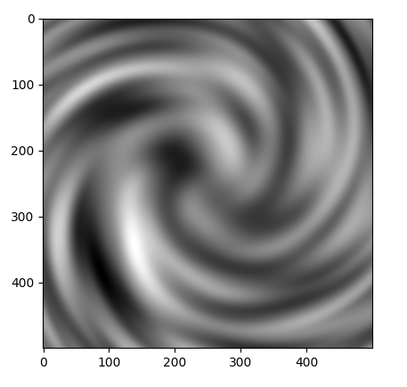

## Explore an Infinite Galaxy!
Full Galaxy Simulator with platforming in mind all made in godot!

### Planet Generator
Currently using a 3d Vector field Hyper Rosen Randomly Fills in Spaces while keeping the areas of other planets in mind 

### Plans for Generator
- Use perlin noise
- Swirl effect
- Relu number map 
- Planet Placement 

#### TO do 
-   Animal Generation 
-   Crafting System

Amplitude Y axis
Frequency X Axis 

#### Creating Terrain 
**Layering noise**
octaves:  
lacunarity = lacunarity ^ x =  x +1 
     Increases the Frequency   
    determines the frequency of how a octave increases 
persistance = persistance ^ x -1 
    affects the Amplitude
      
Example 
    Octave 1 = main outline
        lacunarity = 1 
         amplitude = 1    
     Octave 2 = boulders (less Smooth )
        lacunarity = 2
         amplitude = 2
     Octave 3 = small rocks (Least smooth)
        lacunarity = 3
         amplitude = 3
     
octave shifts

## Shaping the galaxy

Creating a Galaxy MAP 
- Perlin noise generates a 2D map 
- swirl noise using a swirl filter 
* using Relu functions convert black and white values into 0-1 based on strengths 
    * scale fields according to planet sizes
* Place planets in the 1 fields and the less weighted values will have gasses and stars 

